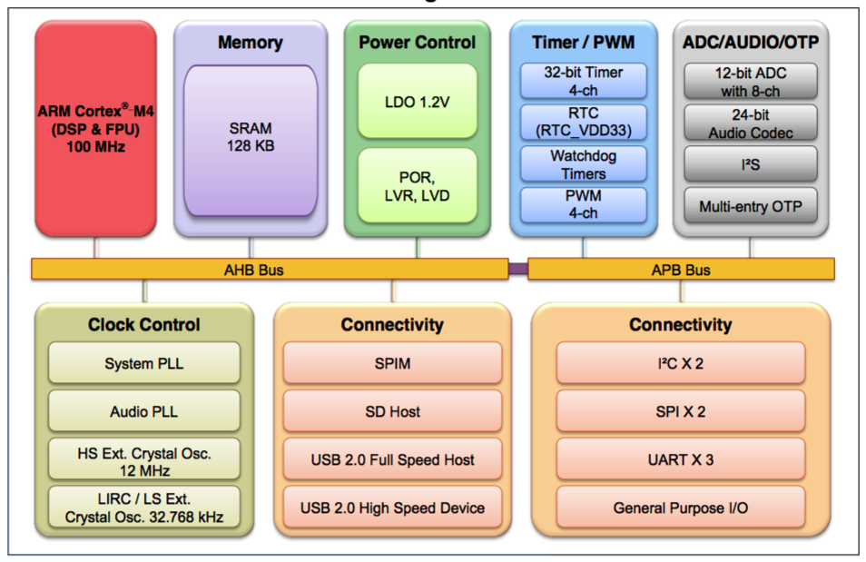
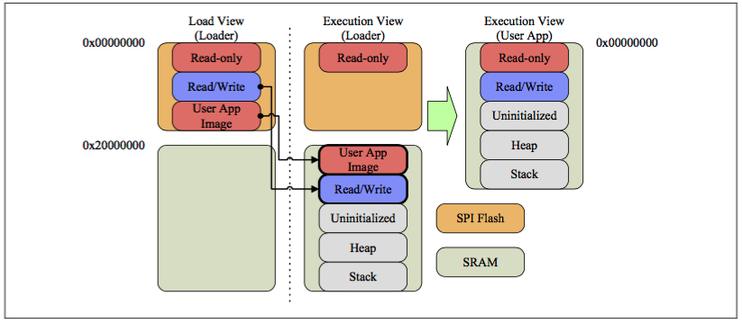
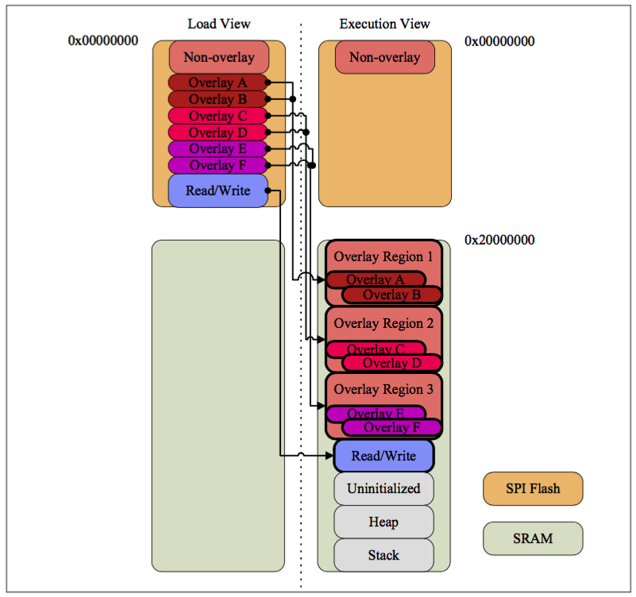

# Nuvoton NUC505

The NuMicro NUC505 series 32-bit microcontroller is embedded with the ARM Cortex-M4F core running up to 100 MHz, supports DSP FPU function, and provides 512 KB / 2 MB embedded SPI Flash memory, and 128 Kbytes embedded SRAM.

The NUC505 series is also equipped with plenty of peripheral devices, such as USB Host/Device, Timers, Watchdog Timers, RTC, UART, SPI, I2S, I2C, PWM Timer, GPIO, 12-bit ADC, 24-bit Audio CODEC, Low Voltage Reset and Low Voltage Detector.




## Hardware

### Board


- NuTiny-SDK-NUC505Y User Manual: http://www.nuvoton.com/opencms/resource-download.jsp?tp_GUID=UG0120150209183644
- NuTiny-SDK-NUC505Y Schematics: http://www.nuvoton.com/opencms/resource-download.jsp?tp_GUID=HL0120150213163240

### Boot Select (SW1) Settings


Typical case:

- Debug in Keil MDK-ARM (UV4): Set SW4-1 to **0111**
- Programming into Internal SPI Flash with ICP: Set SW4-1 to **1011** before programing and then **1111** after programming done

## Software

### BSP

-  NUC505 Series BSP: http://www.nuvoton.com/opencms/resource-download.jsp?tp_GUID=SW0120141215140101
-  NUC505 Series BSP Readme: http://www.nuvoton.com/opencms/resource-download.jsp?tp_GUID=RM0120151222141552

### Example Code

- NUC505 Series Examples: http://www.nuvoton.com/opencms/products/microcontrollers/arm-cortex-m4-mcus/nuc505-series/Example-Code/?__locale=en&resourcePage=Y

## Development

### Environment

- Keil MDK-ARM or IAR Embedded Workbench

### Driver

- Nu-Link Keil Driver: http://www.nuvoton.com/opencms/resource-download.jsp?tp_GUID=SW0520101208200142

  This driver is to support Nu-Link to work under Keil RVMDK Development Environment for all NuMicro Family Devices.

- Nu-Link IAR Driver: http://www.nuvoton.com/opencms/resource-download.jsp?tp_GUID=SW0520101208200227

  This driver is to support Nu-Link to work under IAR EWARM Development Environment for all NuMicro Family Devices.

### Programming

- ICP Programming Tool: http://www.nuvoton.com/opencms/resource-download.jsp?tp_GUID=SW0520101208200310
- NUC505 ICP Programming Tool User Guide: http://www.nuvoton.com/hq/resource-download.jsp?tp_GUID=DA01-NUC505
- Nu-Link Command Tool: http://www.nuvoton.com/opencms/resource-download.jsp?tp_GUID=SW0520160317094731

### Debug

- In-Circut Emulation Debug in Keil MDK-ARM with Nuvoton Nu-Link Debugger

  Load program on-line and run/stop/step/..., set breakpoings, check memory/variables/call stack/...

- Log trace with `printf`
  * To output log into UART, remove **DEBUG_ENABLE_SEMIHOST** define in **Project -> Options for Target -> C/C++ -> Preprocessor Symbols**

    **UART0: TX - PIN 41, RX - PIN 42**

  * With **DEBUG_ENABLE_SEMIHOST** defined, check log in Keil MDK in debug mode at **View -> Serial Windows -> UART #1**

## Boot

### Power-On Setting


### Memory Model

With space and speed taken into consideration, user may apply memory models introduced here to place critical code/data on SRAM for better performance:

- Typical
- Critical on SRAM
- main() on SRAM
- Full on SRAM
- Overlay.

#### Typical

The **Typical** memory model arranges read-only code/data on SPI Flash and the remaining on SRAM, with read/write data differently handled.


#### Critical on SRAM

Based on the **Typical** memory model, the **Critical on SRAM** memory model moves critical code/data from SPI Flash to SRAM for better performance.


Memory Initialization:

```
/*********************************************************************************************************************
 * VECMAP function is used to map the specified start address to memory address 0x0000_0000.
 * If memory space of SPI Flash on SPIM is mapped to 0x0000_0000, any value of SYS_LVMPLEN  is allowed to map whole
   SPI Flash on SPIM.
 * This initialize file maps the SPI Flash on SPIM to address 0x0000_0000 through VECMAP function.

 * SPIM registers must also configure correctly to map SPI Flash to 0x0000_0000. To match execution context between
   IBR booting and Debugger, relevant settings here will be the same as IBR booting.
 ********************************************************************************************************************/
FUNC void SPIROMMap(void)
{
    _WDWORD(0x40000050, 0x00000000);    /* Specify the load VECMAP address   (reg : SYS_LVMPADDR) */
    _WDWORD(0x40000054, 0x00000000);    /* Any value allowed to map whole SPI Flash (reg : SYS_LVMPLEN)  */
    _WDWORD(0x4000005C, 0x00000001);    /* Load VECMAP address and length    (reg : SYS_RVMPLEN)  */

                                        /* Set SPIM command to Standard Read, set OPMODE to DMM (Direct Memory Map) mode, and
                                           disable 4-byte address mode (reg : SPIM_CTL0) */
    _WDWORD(0x40007000, 0x03C00003);
                                        /* Specify divider for SPI bus clock to 2 (DIVIDER=1), and
                                           continue using IFSEL, which is assumed to match real
                                           hardware connection (reg : SPIM_CTL1) */
    _WDWORD(0x40007004, 0x00010010 | (_RDWORD(0x40007004) & 0x000000C0));
}


SPIROMMap();
RESET
```

Scatter:

```
LR_ROM      0x00000000  0x00200000  ; 2MB (SPI FLash)
{
    ER_STARTUP +0
    {
        startup_nuc505Series.o(RESET, +First)
    }

    ER_RO   +0
    {
        *(+RO)
    }

    ; Relocate vector table in SRAM for fast interrupt handling.
    ER_VECTOR2      0x20000000  EMPTY   0x00000400
    {
    }

    ; Critical code in SRAM for fast execution. Loaded by ARM C library at startup.
    ER_FASTCODE_INIT    0x20000400
    {
        clk.o(+RO); CLK_SetCoreClock() may take a long time if it is run on SPI Flash.
    }

    ER_RW   +0
    {
                *(+RW)
    }

    ; Critical code in SRAM for fast execution. Loaded by user.
    ER_FASTCODE_UNINIT  +0  OVERLAY
    {
        *(fastcode)
    }
}

LR_RAM      0x20010000  0x00010000
{
    ER_ZI +0
    {
        *(+ZI)
    }
}
```

#### Main on SRAM

The **main() on SRAM** memory model makes the idea further by moving all code/data to SRAM except unmovable part.


Memory Initialization:

> Same as **Critical on SRAM**

Scatter:

```
LR_ROM      0x00000000
{
    ER_STARTUP  +0
    {
        startup_nuc505Series.o(RESET, +First)   ; vector table
        *(InRoot$$Sections)                     ; library init
        ; If neither (+ input_section_attr) nor (input_section_pattern) is specified, the default is +RO.
        startup_nuc505Series.o                  ; startup
        system_nuc505Series.o(i.SystemInit)
    }

    ; Relocate vector table in SRAM for fast interrupt handling.
    ER_VECTOR2  0x20000000  EMPTY   0x00000400
    {
    }

    ER_RO       +0
    {
        *(+RO)
    }

    ER_RW       +0
    {
        *(+RW)
    }

    ER_ZI       +0
    {
        *(+ZI)
    }
}
ScatterAssert(LoadLimit(LR_ROM) <= 0x00200000)
ScatterAssert(ImageLimit(ER_ZI) <= 0x20020000)
```

Link Option:

```
--cpu Cortex-M4.fp ".\obj\startup_nuc505series.o" ".\obj\system_nuc505series.o" ".\obj\retarget.o" ".\obj\clk.o" ".\obj\uart.o" ".\obj\main.o" 
--library_type=microlib --strict --scatter ".\main_on_sram.ld" 
--map --datacompressor=off --info=inline --entry Reset_Handler 
--autoat --summary_stderr --info summarysizes --map 
--info sizes --info totals 
--list ".\lst\MainOnSRAM.map" -o ".\obj\MainOnSRAM.axf"
```

#### Full on SRAM

Same as the **main() on SRAM** memory model, the **Full on SRAM** memory model moves all code/data to SRAM with another approach.



Memory Initialization:

```
/****************************************************************************************************/
/* VECMAP function is used to map the specified start address to memory address 0x0000-0000.        */
/* This initialize file maps the SRAM (0x2000-0000) to address 0x0000_0000 through VECMAP function. */
/****************************************************************************************************/
FUNC void SRAMMap(void)
{
 _WDWORD(0x40000050, 0x20000000);                       /* Specify the load VECMAP address   (reg : SYS_LVMPADDR) */
 _WDWORD(0x40000054, 0x00000080);                       /* Specify the VECMAP length : 128KB (reg : SYS_LVMPLEN)  */
 _WDWORD(0x4000005C, 0x00000001);                       /* Load VECMAP address and length    (reg : SYS_RVMPLEN)  */
}

SRAMMap();
LOAD %L INCREMENTAL
RESET
```

Link Option:

```
--cpu Cortex-M4.fp ".\obj\system_nuc505series.o" ".\obj\startup_nuc505series.o" ".\obj\retarget.o" ".\obj\clk.o" ".\obj\sys.o" ".\obj\uart.o" ".\obj\main.o" 
--library_type=microlib --ro-base 0x00000000 --entry 0x00000000 --rw-base 0x20000000 
--entry Reset_Handler --first __Vectors --strict --map 
--first='startup_nuc505series.o(RESET)' --datacompressor=off --info=inline --entry Reset_Handler 
--autoat --summary_stderr --info summarysizes --map --xref --callgraph --symbols 
--info sizes --info totals --info unused --info veneers 
--list ".\lst\hello.map" -o ".\obj\hello.axf"
```

#### Overlay

The **Overlay** memory model divides a large program into multiple pieces of code/data which are loaded into SRAM when required.



> http://www.nuvoton.com/hq/resource-download.jsp?tp_GUID=DA01-NUC505-1

### Example

Template: https://github.com/robbie-cao/nuc505/tree/master/SampleCode/BootTemplate

## Security

- http://www.nuvoton.com/hq/resource-download.jsp?tp_GUID=DA01-AN0001

## Reference

- NUC505 Series Overview: http://www.nuvoton.com/hq/products/microcontrollers/arm-cortex-m4-mcus/nuc505-series/?__locale=zh
- NuTiny-SDK-NUC505 User Manual: http://www.nuvoton.com/hq/resource-download.jsp?tp_GUID=UG0120150209183644
- Schematics: http://www.nuvoton.com/hq/resource-download.jsp?tp_GUID=HL0120150213163240
- Datasheet: http://www.nuvoton.com/hq/resource-download.jsp?tp_GUID=DA00-NUC505
- Technical Reference Manual: http://www.nuvoton.com/hq/resource-download.jsp?tp_GUID=DA05-NUC505-SC
- Sample Code: http://www.nuvoton.com/hq/resource-download.jsp?tp_GUID=SW0120141215140101
- Development Resource DVD: http://www.nuvoton.com/NuMicroDVD
